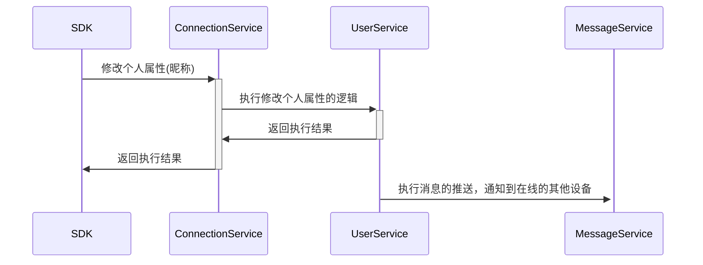
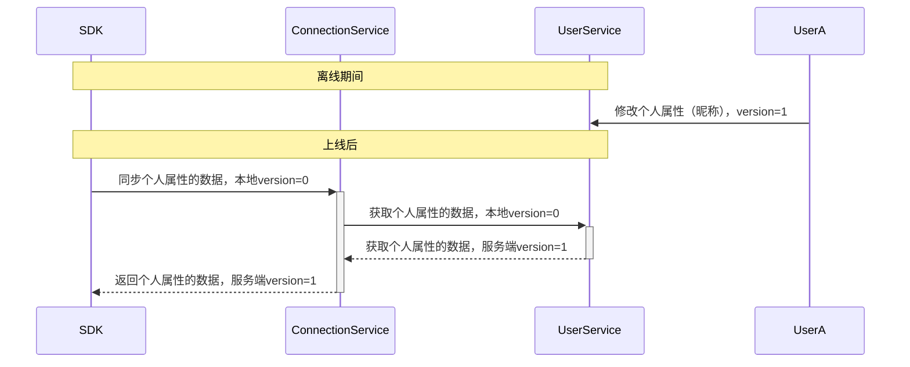
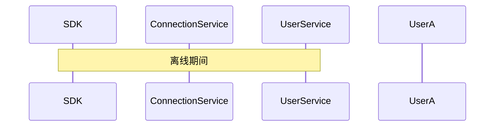
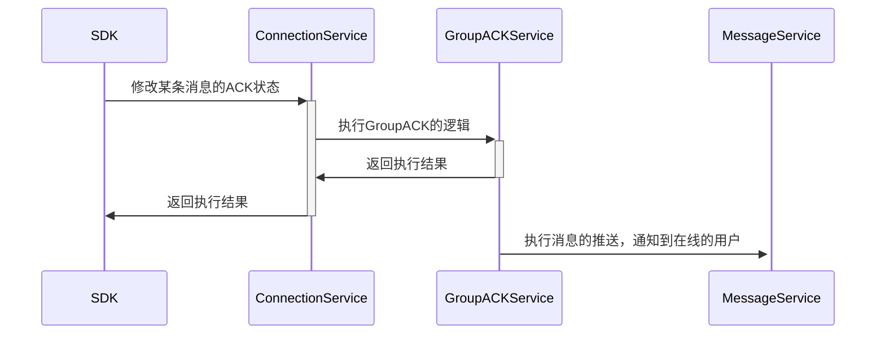
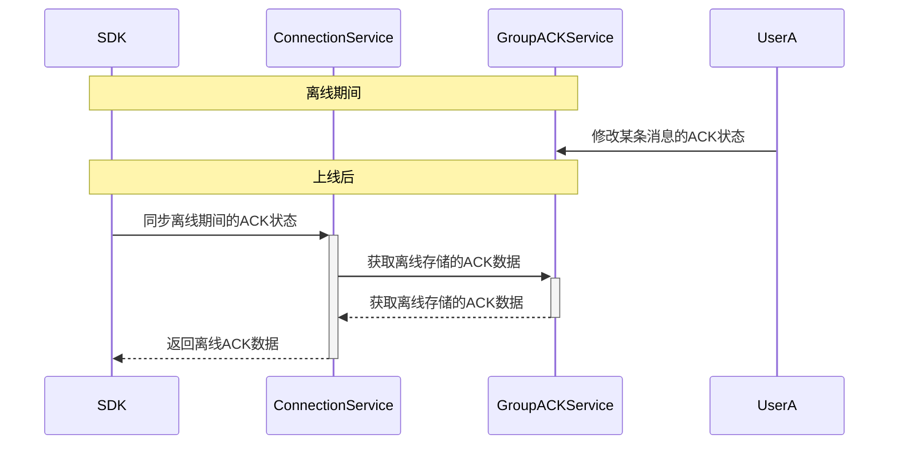
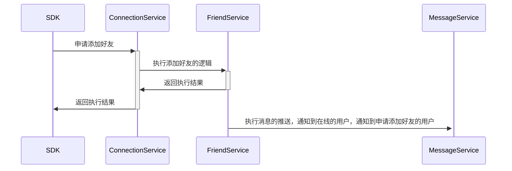
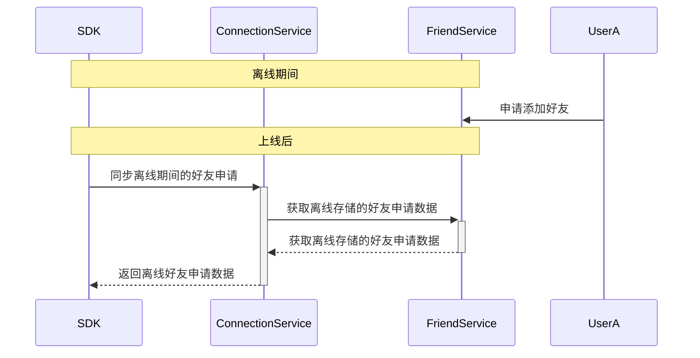
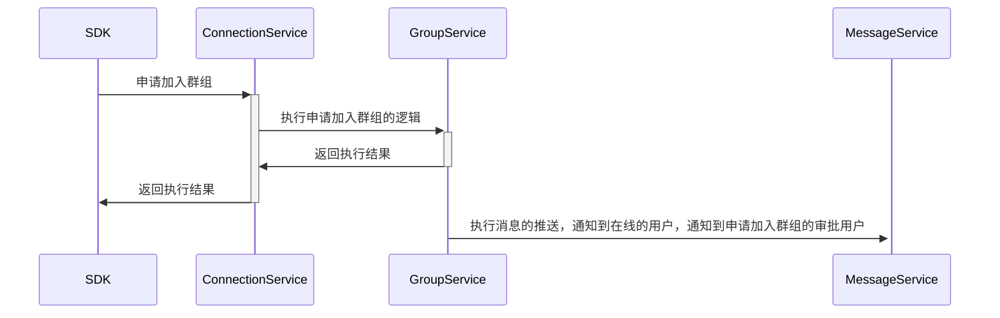
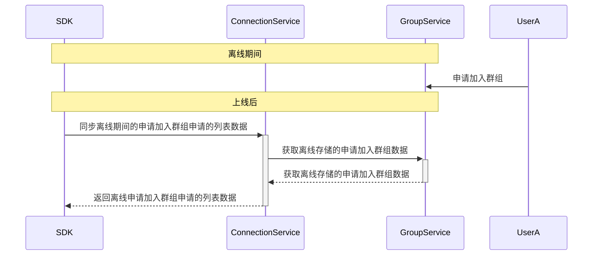

## 业务层&IM层的分层

业务通过IM层完成数据变更的在线同步。

- 重关联数据

  - 个人属性（昵称、头像、签名）
  - 好友列表
  - 加入的群组列表
  - 我发送的消息状态（已读、未读）

- 中关联数据

  - 群组属性（群名称、群头像、群公告，人数）
  - 群组人员列表

- 轻关联数据

  - 群人员的属性（昵称、头像、签名）
  - 其他人发送的消息状态

## 业务状态数据同步

### 重关联数据

  - 个人属性（昵称、头像、签名）
  - 好友列表
  - 加入的群组列表
  - 我发送的消息状态（已读、未读）

下面个人的属性为例子，业务侧理解为 ```昵称```

个人昵称的变更其他的设备，其他设备能够及时更新昵称。

1. 在线场景下，其他的设备能够实时收到变更的通知。
2. 离线场景下，其他的设备能够通过拉取最新的个人属性数据，更新昵称。（此处可以通过版本号来判断是否需要更新）

#### 在线场景



#### 离线场景



#### 混合场景

- 用户的昵称修改
- 被加入群组
- 我发送的投票消息，被其他人投票了



### 群组消息已读

#### 在线场景



#### 离线场景



### 好友场景

好友相关的操作，某个人操作好友，需要通知到好友的在线用户。
离线用户在登录同步相应的变更数据。

#### 在线场景



#### 离线场景



### 群组场景

群组相关的操作，某个人操作群组，需要通知到群组内的其他在线用户。
离线用户在登录或者合适的时机同步响应的变更数据。

#### 在线场景



#### 离线场景



