# 业务层

## 业务数据的分类

业务通过IM层完成数据变更的在线同步。

业务层的数据分类，主要根据数据的重要程度进行分类。

### 强关联数据

    账号级别的重要数据，一般需要完整的进行同步，需要保证强一致性。

  - 个人属性（昵称、头像、签名）
  - 好友列表
  - 加入的群组列表以及群组属性（群名称、群头像、群公告，人数）
  - 我发送的消息状态（已读、未读）

### 弱关联数据

    弱关联数据，一般需要进行部分同步，保证数据最终一致性。比如漫游消息在下拉的时候拉取更多，群组成员列表在拉取更多的时候拉取更多。
  
  - 群组人员列表
  - 消息列表


  - 群人员的属性（昵称、头像、签名）
  - 其他人发送的消息状态

## 业务状态数据同步

### 强关联数据

  - 个人属性（昵称、头像、签名）
  - 好友列表
  - 加入的群组列表
  - 我发送的消息状态（已读、未读）

下面个人的属性为例子，业务侧理解为 ```昵称```

个人昵称的变更其他的设备，其他设备能够及时更新昵称。

1. 在线场景下，其他的设备能够实时收到变更的通知。
2. 离线场景下，其他的设备能够通过拉取最新的个人属性数据，更新昵称。（此处可以通过版本号来判断是否需要更新）

#### 在线场景

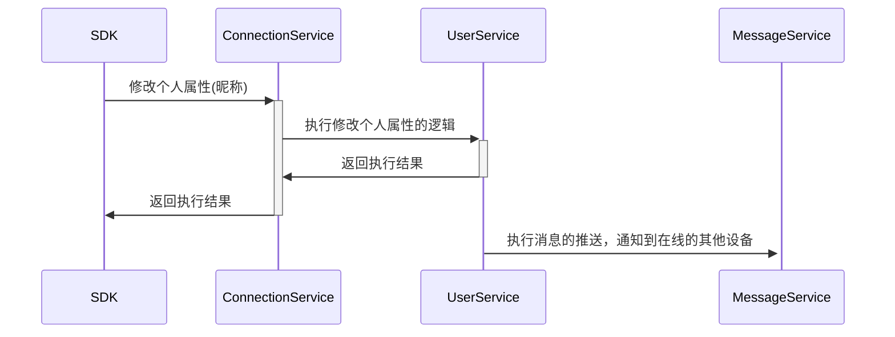

#### 离线场景

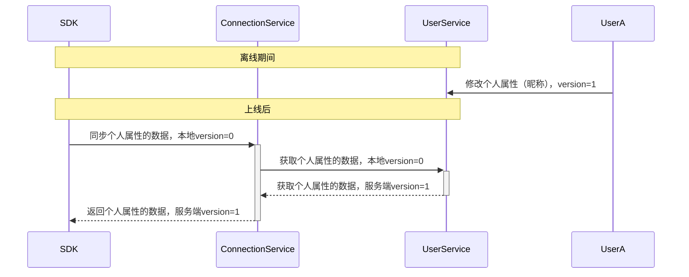

### 群组消息已读

#### 在线场景

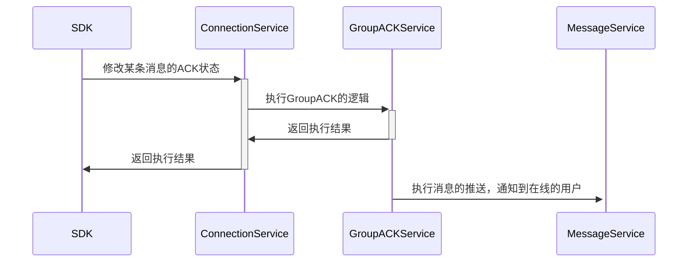

#### 离线场景

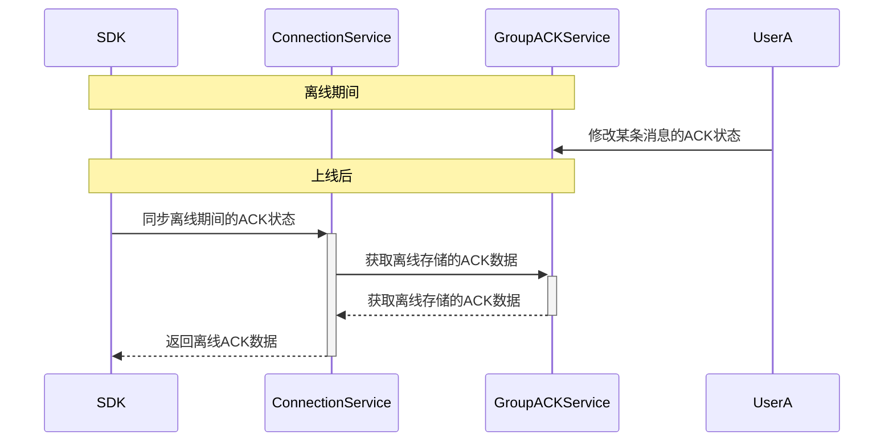

### 好友场景

好友相关的操作，某个人操作好友，需要通知到好友的在线用户。
离线用户在登录同步相应的变更数据。

#### 在线场景

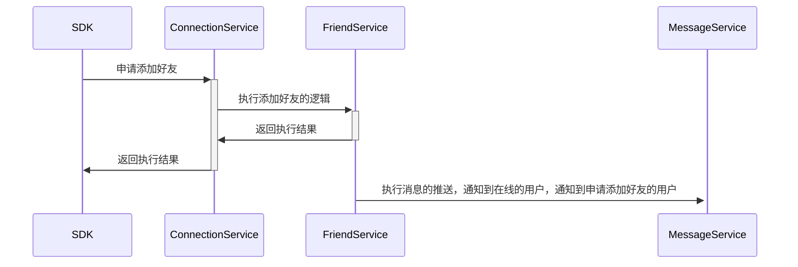

#### 离线场景

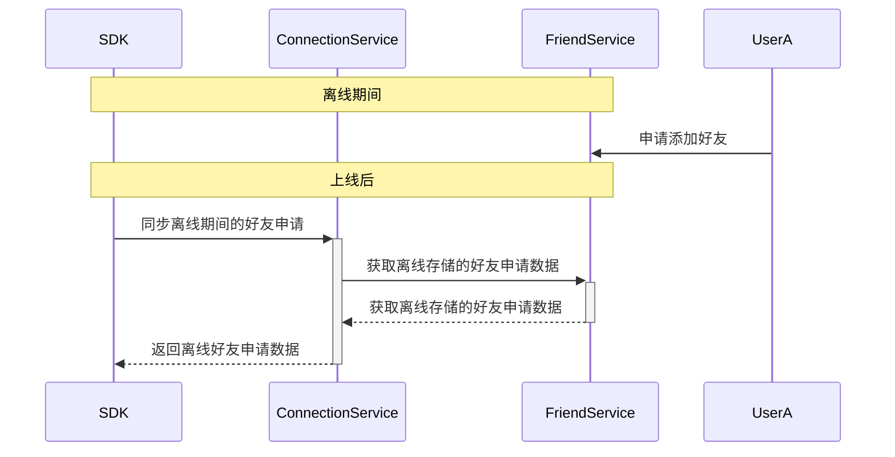

### 混合场景

- 用户的昵称修改
- 被加入群组
- 我发送的投票消息，被其他人投票了

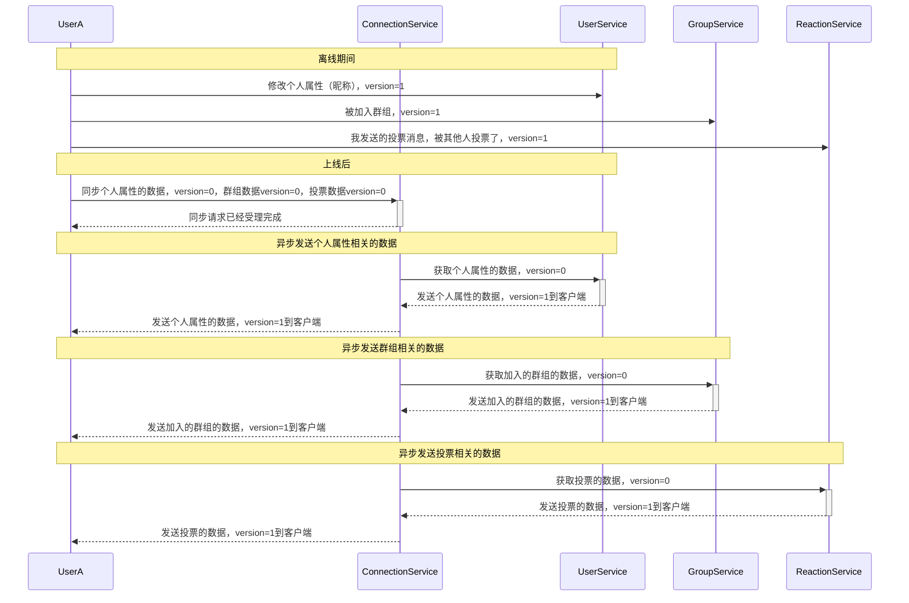

## 弱关联数据

### 群组加人场景

群组加人场景，群主加人，需要通知到被加人的在线用户。

#### 在线场景

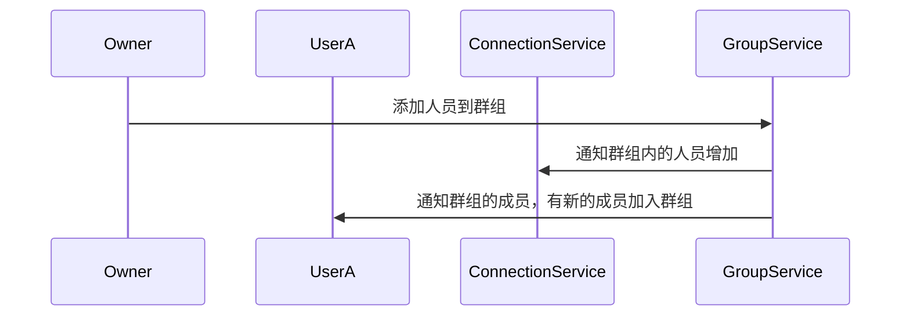

#### 离线场景

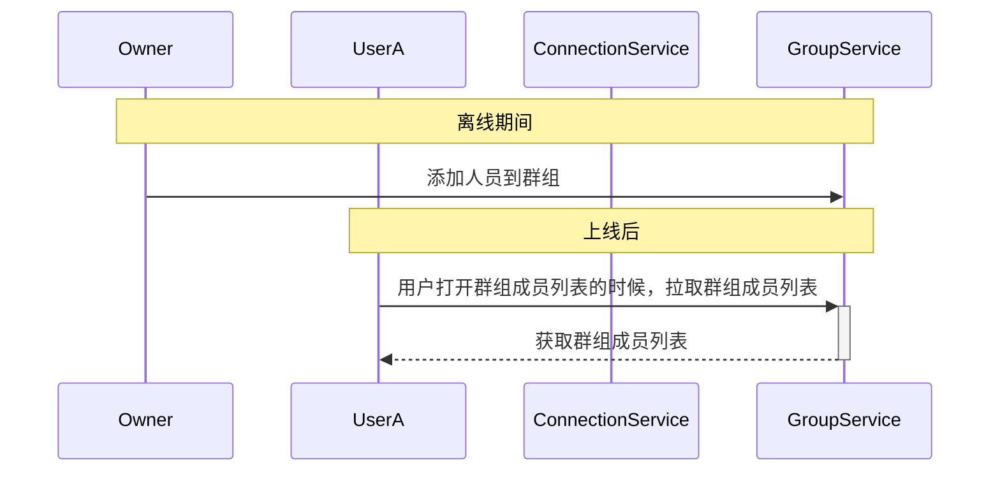

### 群组消息列表

群组消息列表，用户打开群组消息列表，需要拉取群组消息列表。

#### 在线场景

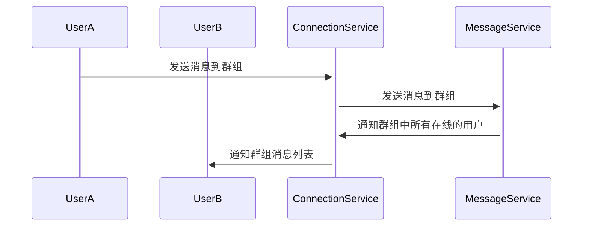

#### 离线场景

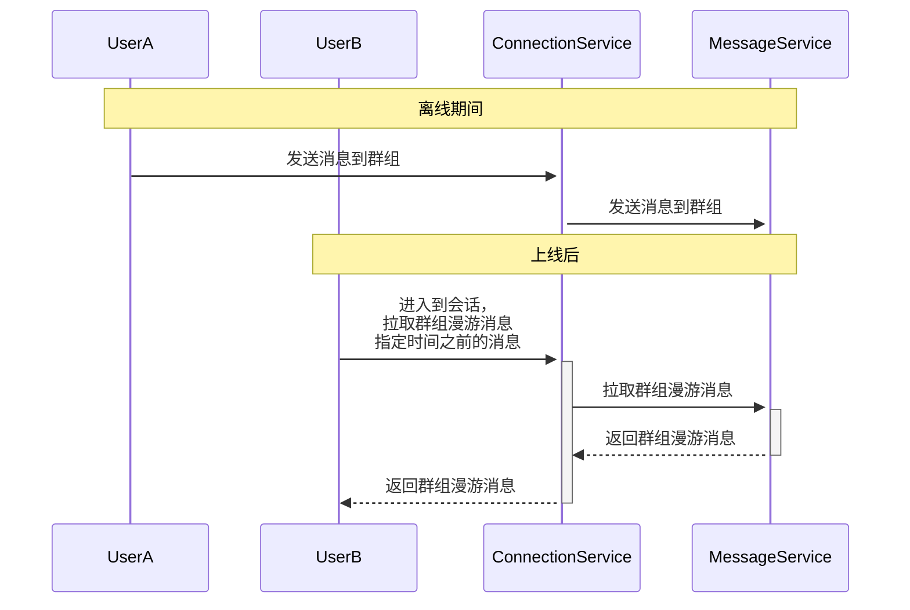

### 群组成员头像属性

群组成员头像属性，用户打开群组成员列表，需要拉取群组成员头像属性。
该场景不区分在线和离线，因为该场景是弱关联数据，不需要保证强一致性。

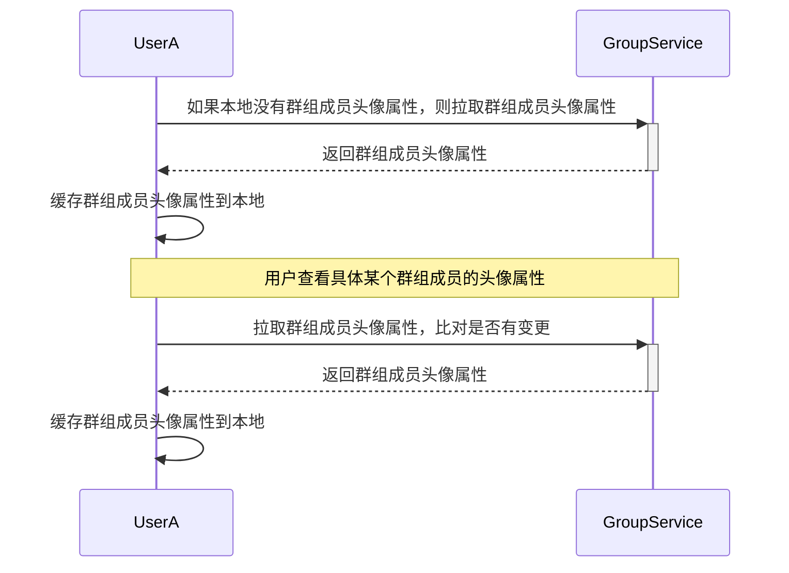

基于场景的数据对比，可能通过SDK的很难确定，基于业务侧的场景，可以确定。就上面这个群组成员属性，
可以通过下面的结构存储相关数据，

| 群组ID | 群组成员ID | 群组成员头像属性 |
| ------- | ---------- | ---------------- |
| 1       | 1          | xxxxx                |
| 1       | 2          | yyyyy                |

数据量本身不大的话，就没有version对比的必要性，直接返回相应的数据即可。
